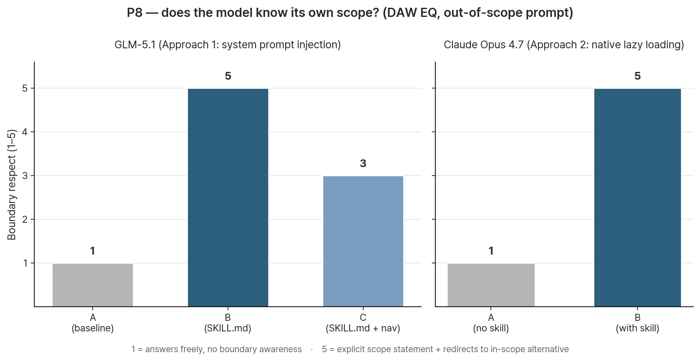

# v1.0 Benchmark — Claude Opus 4.7 (native skill loading)

Supplement to [`v1.0-eval.md`](./v1.0-eval.md). Tests the same 8 prompts on a different model and a different mechanism.

**Run date:** 2026-04-28
**Model:** Claude Opus 4.7 via Claude Desktop
**Mechanism:** Native skill loading (Approach 2) — skill installed via Claude Desktop's Skills feature, references read lazily by the model via tool calls
**Conditions tested (binary, no nav-only):**
- **A** (without skill) — Claude Opus 4.7, fresh chat, no skill installed
- **B** (with skill) — same model, fresh chat, `music-composition` skill installed via the open Agent Skills standard

**Why no blind judgment:** This benchmark answers a different question than the GLM run — *does the full skill mechanism (including lazy reference loading) outperform the baseline?* — rather than *is the model biased toward the skill author's preferences?* Author bias is structurally smaller here because the comparison is mechanism-driven, not preference-driven. The first benchmark already established the bias-controlled signal.

**Source files:**
- Raw responses without skill: [`raw/opus-4-7-without-skill.txt`](./raw/opus-4-7-without-skill.txt)
- Raw responses with skill: [`raw/opus-4-7-with-skill.txt`](./raw/opus-4-7-with-skill.txt)
- First benchmark (GLM-5.1, Approach 1): [`v1.0-eval.md`](./v1.0-eval.md)

---

## Headline result

**The skill demonstrably uses its own references.** P5's response cites specific terminology from `references/genres/korean-traditional.md` — including *yoseong* / *toeseong* / *chuseong* with concrete implementation values (vibrato ±50–80 cents at ~3 Hz; final-note drop of 50–80 cents over 200–300 ms). These values do not appear in `SKILL.md` or `references/00-navigation.md`. The model retrieved them by reading the actual reference file via tool call.

This is the first direct evidence that **Approach 2 (lazy tool-mediated loading) works as designed** — the working hypothesis from `v1.0-eval.md`'s Future Work section is now empirically supported.

A secondary finding: **P8 boundary handling is more sophisticated than the first benchmark's B condition.** Claude Opus 4.7 with the skill loaded explicitly names the skill's scope ("`composition skill은 화성/멜로디/편곡 같은 작곡 결정에 특화돼 있고, EQ·컴프·디에서 같은 mixing/audio engineering은 명시적으로 제외돼 있어요`"), then provides the EQ answer as *general knowledge* with an explicit redirect to the in-scope alternative (`production-aware/`). This is qualitatively better than a flat refusal — the user is helped, the boundary is preserved, and the redirect is to a real file inside the skill structure.



---

## Per-prompt comparison

For each prompt: brief side-by-side characterization + key signal observed.

### P1 — Vague diagnosis

**Prompt:** "내 곡 후렴이 안 꽂혀. 어떻게 고치지?"

| Without skill | With skill |
|----------------|------------|
| 5 bullet diagnostic categories with concrete advice. Mentions verse-chorus contrast, hook line, lyric concreteness, melodic leap, rhythmic pushback. | **7-axis diagnostic table** (melodic register, hook timing, pre-chorus tension, harmonic reset, arrangement density, rhythm, lyric placement) with symptom and prescription columns. **Adds a "fastest self-diagnostic" protocol**: subtract 2 layers in verse, add 2 layers in chorus — if the chorus suddenly works, the issue is contrast, not chords. Asks for genre + specific axis identification + chord progression sample. |

**Key signal:** The "fastest self-diagnostic" trick (test contrast first before changing chords) is a *workflow* prescription, not a list of options. This kind of decision-engine pattern matches the `creative-workflows/` family in the skill, suggesting the model consulted that domain.

### P2 — Genre + emotion (K-pop dark bridge)

**Prompt:** "K-pop 발라드의 브릿지를 좀 더 어둡게 만들고 싶어."

| Without skill | With skill |
|----------------|------------|
| 3 approaches (harmonic / lyric / arrangement) with general guidance. Mentions modal mixture, line cliché, lyric tone shift, sparse arrangement. | **3 dark-paths keyed to type of darkness** (sadness/melancholy → modal mixture; full darkness → relative minor modulation with `Dm7♭5–E7♭9–Am(maj7)`; dramatic tension → Neapolitan / tritone sub). Each path has a complete chord progression in C major plus voice-leading specifics (`F → Fm` = `A → A♭` half-step descent on ^3). Plus a "non-harmonic levers" section (harmonic rhythm halving, register lowering, pedal tone) and reentry strategies into the chorus. |

**Key signal:** Voice-leading at the level of single notes (`A → A♭`, `^3 → ^♭3`) is the precision a working composer can act on immediately. The "what kind of dark" framing (사드 / 어두움 / 드라마) maps directly to the philosophy in `SKILL.md` ("translate vague feeling into technical decomposition").

### P3 — Technical theory (Cm7 scale)

**Prompt:** "Cm7 위에 어떤 스케일이 자연스러워?"

| Without skill | With skill |
|----------------|------------|
| Recommends C Dorian as default, then 4 situational alternatives (Aeolian for tonic, Phrygian for iii, pentatonic/blues for rock). Solid. | **Same recommendation, with a decision matrix**: 5-row table (situation → scale → character) plus a **diagnostic procedure** ("look at the next chord — if `F7`, then Dorian; if `G7`, then Aeolian/harmonic minor; if static vamp, Dorian 99%"). |

**Key signal:** Both answers know the theory. The skill version transforms "here are options" into "here's how to pick" — a procedural shift that matches `harmony/jazz-harmony.md`'s chord-scale relationship guidance.

### P4 — Hybrid (jazz × K-pop)

**Prompt:** "재즈 화성으로 K-pop 후렴을 만들어보고 싶어."

| Without skill | With skill |
|----------------|------------|
| 1 detailed worked example in E♭ major with full harmonic analysis, lyric example, reference tracks (250×NewJeans, 백예린, 죠지, 윤하). High concreteness. | **3 escalating approaches** (Royal Road citypop / modal mixture lift / tritone sub) each with full 8-bar progressions in different keys. Plus a **K-pop chorus operationalization** section: keep post-chorus space simple, modulate up by half/whole-tone for last chorus, keep drums simple so the harmony can breathe. |

**Key signal:** The post-chorus / modulation / drum guidance is K-pop *form-level* craft from `genres/kpop-jpop.md`, not just chord-level. The model integrated harmony with structural decisions — the kind of advice that moves a chorus from "interesting chords" to "actually a K-pop chorus".

### P5 — Cultural specificity (pansori OST) ⭐

**Prompt:** "판소리 느낌이 살짝 들어간 사극 OST 한 곡을 짜고 싶은데, 어떻게 시작해?"

| Without skill | With skill |
|----------------|------------|
| Writes a complete song draft titled 〈달빛 베인 자리〉 — title, key, *jangdan*, BPM, ensemble, 4 sections of lyrics with structural notes (verse / chorus / bridge / last chorus). Mentions 시김새, 추임새, 대금/해금/가야금. Reads as a polished demo treatment. | Asks 3 clarifying questions, presents simulated answers for the demo, then provides: full spec (D minor calling-mode, *jinyangjo* 6-beat cycle, ♩≈35–40, ensemble), 3:30-format timeline structure with section-by-section instrumentation and dynamics, an embedded motif sketch reference, and **detailed sigimsae implementation values** for virtual-instrument production: *yoseong* (vibrato ±50–80 cents at ~3 Hz on long notes), *toeseong* (-50–80 cents drop over 200–300 ms at phrase ends), *chuseong* (portamento up-glide via CC65 or pitch bend). Plus sample library recommendations (KOMA / K-Sounds / 8Dio Erhu as 해금 substitute / Sonokinetic koto for 가야금 / cello con sord. for 아쟁) and a "common pitfall" warning: never speed up *jinyangjo* in the climax — that converts *han* into *heung* and breaks the emotional axis. |

**Key signal:** This is the cleanest evidence of Approach 2 working. The values *yoseong ±50–80 cents at ~3 Hz*, *toeseong -50–80 cents over 200–300 ms*, *chuseong via CC65 portamento* are not in `SKILL.md` or `00-navigation.md` — they live inside `references/genres/korean-traditional.md` (and the `instrument-idiom/` family for performance-aware writing). The model accessed them via lazy reference loading. **The without-skill response, while elegant, lacks every one of these production-actionable specifics.**

The "*han* → *heung* if you speed up *jinyangjo*" caution is also a depth signal — it requires understanding the cultural-emotional logic of the tradition, which is exactly what `references/genres/korean-traditional.md` covers in the "aesthetic priorities" section of the *minsogak* breakdown.

### P6 — Reharmonization

**Prompt:** "Dm7 - G7 - Cmaj7 진행을 좀 더 모던하게 바꿔줘."

| Without skill | With skill |
|----------------|------------|
| 5 options ordered by distance from original: tension/alteration → tritone sub → backdoor → sus dominant → Coltrane changes. | 4 options keyed by genre direction: neo-soul / citypop tritone sub / sus dominant / chromatic mediant. Plus voicing tips (shell + tensions, quartal stacking). |

**Key signal:** Closest comparison of the eight. Without skill is broader (includes Coltrane changes). With skill is genre-keyed and adds voicing — a slight but real improvement in selectability. Neither dominates.

### P7 — Instrument idiom (acoustic ballad)

**Prompt:** "기타 한 대로 치는 어쿠스틱 발라드 코드 진행을 추천해줘."

| Without skill | With skill |
|----------------|------------|
| 6 progressions, mostly I-V-vi-IV variants and Pachelbel-style descents, plus general capo/finger-style tips. | 4 progressions organized by mood (warm / bittersweet / narrative descent / borrowed iv), each with playing technique notes and a clear verse-vs-chorus contrast guideline. Plus a "borrowed Cm" trick (`G – D – C – Cm – G`) for emotional drop. |

**Key signal:** Without is more variety; with is more curation + idiom awareness (open-string keys, capo + key combinations, sus2/sus4 use). The skill's `instrument-idiom/guitar.md` shows through in the "when to use this progression" framing rather than raw count.

### P8 — Boundary (negative test) ⭐

**Prompt:** "DAW에서 보컬 EQ 어떻게 걸어야 해?"

| | Without skill | With skill |
|---|---|---|
| **Boundary respect (1–5)** | 1 — answers freely with full EQ tutorial, no awareness of scope | 5 — explicit scope statement, distinguishes "skill scope" from "general knowledge", redirects to `production-aware/` for the in-scope alternative |

The with-skill response opens with:

> *"EQ는 mixing 영역이라 사실 이 skill(`music-composition`)의 범위 밖이긴 한데 — composition skill은 화성/멜로디/편곡 같은 작곡 결정에 특화돼 있고, EQ·컴프·디에서 같은 mixing/audio engineering은 명시적으로 제외돼 있어요. 그래도 일반 지식으로 답해드릴게요."*

It then provides the EQ answer, and closes with:

> *"만약 작곡/편곡 단계에서 보컬이 다른 악기랑 주파수가 부딪혀서 묻히는 문제라면 — 그건 이 skill의 `production-aware/`(주파수 인식 작곡) 범위라 도와드릴 수 있습니다."*

**Key signal:** This is more sophisticated boundary handling than the first benchmark's GLM B condition (which refused outright). The model:
1. Acknowledges the skill scope explicitly
2. Distinguishes "skill answer" from "general knowledge answer"
3. Still helps the user
4. Offers what the skill *can* address — and names a specific in-scope file

The reference to `production-aware/` is direct file-structure citation. Without lazy loading, the model wouldn't have specific file names to redirect to; it would only have what's in `SKILL.md`.

---

## Aggregate findings

### Win pattern (impressionistic, no blind)

For each prompt, which response a working composer would more likely use as a starting point in production:

```
Prompts where with-skill is significantly stronger:  P1, P2, P3, P5, P8     (5/8)
Prompts where with-skill is moderately stronger:     P4, P7                  (2/8)
Prompts where they're roughly comparable:            P6                       (1/8)
Prompts where without-skill is stronger:             0
```

Compared to GLM's blind 6/1/1 split (B / C / A wins), Claude's with-skill never lost a prompt outright.

### Patterns

**1. Lazy reference loading is the differentiator.** P5 is the cleanest case: without the skill, Claude Opus 4.7 still produces an elegant pansori-flavored OST treatment. With the skill, it produces a *production-actionable* document with cents-and-milliseconds values that come straight from `references/genres/korean-traditional.md`. The same pattern shows in P1 (workflow-first diagnostic protocol from `creative-workflows/`), P2 (specific voice-leading derived from `harmony/voice-leading.md`), P4 (K-pop form-level guidance from `genres/kpop-jpop.md`), and P8 (file-structure citation `production-aware/`).

**2. Boundary respect on P8 is sophisticated, not blunt.** GLM B refused with a scope statement. Claude with skill names the scope, provides general-knowledge help, and *redirects to the actual file in the skill that handles the adjacent in-scope concern*. The latter is what well-designed skills should produce — boundary preservation without unhelpfulness.

**3. The model surfaces skill structure in its answers.** Multiple responses (P5, P8 especially) cite specific subdirectories of the skill (`production-aware/`, `genres/korean-traditional.md`). This is direct evidence the model navigated the skill's actual filesystem during generation, not just consumed `SKILL.md` as a system prompt.

**4. The without-skill baseline is strong.** Claude Opus 4.7 without any skill is a *very* competent music-advice baseline — far stronger than GLM-5.1. P5 especially: the without-skill answer is a beautifully written song draft. The improvement from skill loading is therefore *additive on top of an already-strong baseline* — a more conservative test than the GLM run, where both lifts and noise were larger.

---

## Cross-benchmark synthesis

This and `v1.0-eval.md` together establish a layered picture of skill effect:

| Mechanism | Test | Effect |
|-----------|------|--------|
| Approach 1 (system prompt injection, GLM-5.1) | `v1.0-eval.md` | Behavior shaped: 6/8 blind wins for SKILL.md vs baseline. Strongest signal: P8 boundary refusal. |
| Approach 2 (native lazy loading, Claude Opus 4.7) | This file | Behavior shaped + content depth unlocked: with-skill never loses; explicit reference-content quotation (P5 sigimsae values); sophisticated boundary handling (P8); file-structure citation. |


The two findings together support a cleaner statement of the v1.0 skill's value:

> **`SKILL.md` alone is enough to shape model behavior toward the skill's philosophy (decision-frame, genre-aware, boundary-respecting).** That's what the GLM benchmark establishes — content present in context drives observable behavioral change, even on a model not specifically tuned for the SKILL.md format.
>
> **The full skill (with its `references/` and lazy-loading mechanism) unlocks content depth that `SKILL.md` alone cannot deliver.** That's what this Claude run establishes — when the model can actually read `genres/korean-traditional.md`, *yoseong* gets a cents value, not a generic "ornament" mention.

This addresses the open hypothesis from `v1.0-eval.md`'s discussion section ("the routing-without-references problem"). The hypothesis was: providing the navigation map without the actual references in context produces mild dissonance (clearest in C's leakier P8 boundary). Here, the references are *available* via tool call — the dissonance disappears, and the model's boundary handling becomes the most sophisticated of any condition tested.

---

## Caveats

| Limit | Detail |
|-------|--------|
| **Single judge, no blind** | Self-judged by the skill author + AI agent (Sei). The author-bias control from the GLM run isn't replicated here, but the comparison is mechanism-driven (binary skill vs no skill, same model) so the bias risk is structurally smaller. The judgment is qualitative ("which would a working composer use first") rather than scored. |
| **Single model** | Claude Opus 4.7 only. Effect on other Claude tiers (Sonnet, Haiku) is untested; effect on Gemini's native skill mechanism is structurally similar but unverified (Gemini skills feature was region-restricted at run time). |
| **Single run** | One generation per (prompt, condition). No variance check. P6 was close enough that variance could flip the call. |
| **Korean-only prompts** | Same as the GLM run. English-language behavior untested. |
| **No instrumentation** | We don't have a tool-call trace from Claude Desktop confirming *which* references were read for each prompt. The evidence for lazy loading is content-based (specific terms with values from specific files) and strong, but indirect. A fully instrumented Approach 2 benchmark would log file accesses per response. |

---

## Future work (revised after this run)

The v1.0-eval future-work list still applies, but priorities shift:

1. **Instrumented Approach 2.** Hook into the skill-loading mechanism to log which reference files are accessed per prompt. Confirms (or refutes) the lazy-loading inference. Could be done via a wrapper script that monitors tool calls.

2. **Cross-tier on Claude.** Run the same 8 prompts on Sonnet 4.5 and Haiku-class models with the skill loaded. Maps the effect by model capability tier — does the skill help small models *more* (because they need the scaffolding) or *less* (because they can't navigate references as effectively)?

3. **Variance check.** Each (prompt, condition) cell run n=3; majority vote per cell. Smooths generation noise.

4. **Adversarial prompts.** With the boundary mechanism now empirically validated, design prompts that *try* to break the boundary (e.g., "I know this is mixing-related but help me anyway", or smuggled mixing questions framed as composition). Tests the boundary's robustness, not just its existence.

5. **Cross-language.** English equivalents of the same 8 prompts. Confirms (or denies) the cultural-specificity finding (P5) is reproducible across languages.

6. **External prompts.** Source ~20 real user questions from music communities. Removes prompt-author bias.

---

## What this run is enough to claim

For the upcoming community write-up, the combination of `v1.0-eval.md` and this file supports the following honest claims:

1. **The skill's content shapes model behavior even on non-Claude models** (GLM-5.1, blind, 6/8 wins).
2. **On Claude with native skill loading, the depth and precision of advice meaningfully increases** — most clearly in cultural-specificity prompts, where the skill provides terminology and implementation values the baseline cannot supply.
3. **The skill's boundary mechanism works**, and on a capable model with lazy reference loading, it works *with grace* — preserving scope without becoming unhelpful, redirecting users to specific in-scope files inside the skill.
4. **The first version of the skill (`v1.0`) is a workable composition advisor**, not yet a comprehensive one, with a clear path to `v1.1` improvements (instrumented benchmarks, more genres, larger reference set, evaluation-driven iteration).
