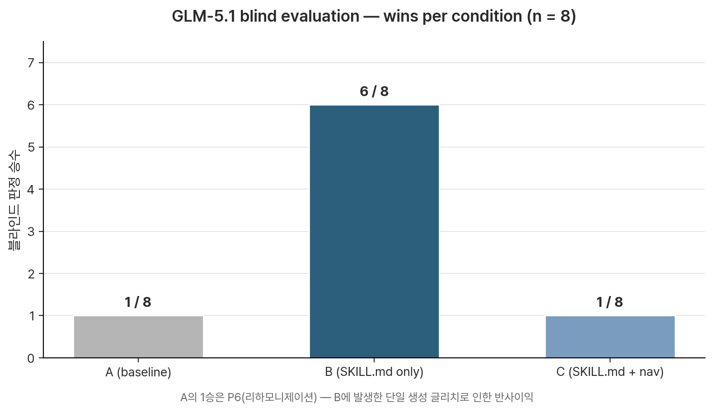

# v1.0 Benchmark Evaluation

Canonical record of the v1.0 skill-on vs. skill-off comparison.

**Run date:** 2026-04-27
**Model:** `glm-5.1` via OpenCode Go (`https://opencode.ai/zen/go/v1`)
**Conditions tested:**
- **A** — generic chat-assistant prompt only
- **B** — generic + `SKILL.md` prepended
- **C** — generic + `SKILL.md` + `references/00-navigation.md` prepended
**Prompts:** 8, spanning vague diagnosis, genre-specific, technical theory, hybrid, cultural specificity, reharmonization, instrument idiom, and a boundary (negative) test.

**Source files:**
- Raw run: [`v1.0-run.md`](./v1.0-run.md), [`v1.0-run.jsonl`](./v1.0-run.jsonl)
- Blind eval document (label-shuffled): [`v1.0-blind.md`](./v1.0-blind.md)
- Blind eval key (de-anonymization): [`v1.0-key.md`](./v1.0-key.md)
- Methodology: [`README.md`](./README.md)

---

## Headline result

| Condition | Wins (blind judgment, n=8) |
|-----------|----------------------------|
| **A** (baseline) | **1 / 8** (P6, due to generation noise in B) |
| **B** (SKILL.md only) | **6 / 8** |
| **C** (SKILL.md + nav) | **1 / 8** (P2) |



The skill content (`SKILL.md`) shapes model behavior in 6 of 8 prompts under blind, author-bias-controlled judgment by a working composer (the skill author, judging without condition labels). The most striking signal is the boundary test (P8): condition B explicitly declines an out-of-scope mixing question; conditions A and C answer it (A fully, C partially).

A counter-intuitive secondary finding: **adding the navigation map on top of `SKILL.md` does not help and sometimes hurts**. Hypothesis: the routing map directs the model to consult specific reference files that aren't actually present in context, producing a mild dissonance that occasionally weakens output (clearest in P8, where C's boundary became leakier).

---

## Per-prompt detail

For each prompt: blind judgment + one-sentence rationale + rubric scores (1–5 per dimension) + brief observation.

### P1 — Vague diagnosis

**Prompt:** "내 곡 후렴이 안 꽂혀. 어떻게 고치지?"

**Blind pick:** B — "진단 체크리스트가 가장 즉시 써먹기 좋고, 멜로디/화성/편곡/가사 훅을 한 번에 분해해서 작곡가가 어디를 고칠지 바로 잡을 수 있음."

| Dimension | A | B | C |
|-----------|---|---|---|
| Concreteness | 3 | 4 | 4 |
| Options | 2 | 4 | 3 |
| Genre awareness | 1 | 4 | 4 |
| Diagnosis depth | 2 | 5 | 4 |
| Pitfall awareness | 2 | 3 | 3 |

**Observation:** A gives 5 generic tips with no diagnostic decomposition or chord examples. B opens explicitly with "진단 먼저, then 처방", offers a 6-row diagnostic table, then 3 specific causes with concrete chord progressions (`C → A♭ → B♭ → C`, `Fm → C → G → C`), and ends with three clarifying questions (장르? 코드 진행? 어떤 안 꽂힘?). The skill philosophy ("translate fuzzy creative problems into technical diagnosis") is visible in B and C, absent in A.

### P2 — Genre + emotion

**Prompt:** "K-pop 발라드의 브릿지를 좀 더 어둡게 만들고 싶어."

**Blind pick:** C — "화성뿐 아니라 선율·텍스처·편곡까지 같이 제시해서 '어둡게'를 실제 브릿지 제작 단계로 옮기기 좋음 ; 일부 표기 오류는 있지만 전체 처방은 가장 실전적."

| Dimension | A | B | C |
|-----------|---|---|---|
| Concreteness | 3 | 5 | 5 |
| Options | 2 | 5 | 4 |
| Genre awareness | 2 | 4 | 5 |
| Pitfall awareness | 1 | 2 | 2 |

**Observation:** A gives generic dark-mood advice without K-pop framing. B and C both deliver concrete C-major chord examples (modal mixture, secondary dominants, chromatic mediants, ♭VI plagal cadence). C wins on integration: it covers harmonic, melodic, textural, and orchestrational layers in one structured response. The only prompt where C beat B in blind judgment.

### P3 — Technical theory

**Prompt:** "Cm7 위에 어떤 스케일이 자연스러워?"

**Blind pick:** B — "Cm7 위에서 자연단조/도리안/펜타토닉/블루스 스케일을 장르별로 구분해 줘서 가장 정확하고 바로 적용하기 쉬움."

| Dimension | A | B | C |
|-----------|---|---|---|
| Concreteness | 4 | 4 | 4 |
| Options | 3 | 4 | 4 |
| Genre awareness | 1 | 5 | 4 |
| Pitfall awareness | 1 | 2 | 1 |

**Observation:** Pure theory questions narrow the gap — A is competent. B's win comes from explicit genre-keyed selection criteria ("재즈 → Dorian, 발라드 → Aeolian, 블루스 → minor pentatonic + ♭5"). C adds Phrygian as a third option (technically valid for Latin contexts) but doesn't quite match B's selection clarity.

### P4 — Hybrid request

**Prompt:** "재즈 화성으로 K-pop 후렴을 만들어보고 싶어."

**Blind pick:** B — "'재즈 색채 + 팝 훅 유지'라는 핵심을 잘 잡고, 난이도별 코드 옵션을 줘서 K-pop 후렴에 재즈 화성을 얹는 방식이 가장 명확함."

| Dimension | A | B | C |
|-----------|---|---|---|
| Concreteness | 5 | 5 | 5 |
| Options | 2 | 5 | 4 |
| Genre awareness | 4 | 4 | 5 |
| Pitfall awareness | 2 | 3 | 3 |

**Observation:** A is itself strong here (8-bar progression with `G7♯5♯9`, approach notes, bossa rhythm). B wins on framing: explicit "재즈의 색채 + 팝의 기억성 유지" thesis, then 4 escalating options. C contributes K-pop reference tracks (*Psycho*, *Levanter*, *INVU*) but the conceptual framing in B was judged more directly useful than concrete references.

### P5 — Cultural specificity

**Prompt:** "판소리 느낌이 살짝 들어간 사극 OST 한 곡을 짜고 싶은데, 어떻게 시작해?"

**Blind pick:** B — "장면 컨텍스트→조/장단→악기 편성→곡 구조→첫 스텝으로 이어져서 사극 OST 데모를 실제로 시작하기 가장 좋음 ; '판소리 느낌 살짝'이라는 비율 조절도 잘 짚음."

| Dimension | A | B | C |
|-----------|---|---|---|
| Concreteness | 3 | 5 | 4 |
| Options | 2 | 4 | 3 |
| Genre awareness | 4 | 5 | 4 |
| Cultural specificity | 3 | 5 | 3 |
| Pitfall awareness | 2 | 4 | 3 |

**Observation:** GLM-5.1 has surprisingly strong baseline Korean traditional knowledge — A is competent on its own. B's edge is depth: a four-row table mapping dramatic context (비극적 죽음 / 전투 / 회상 / 원혼) to specific 조/장단 combinations, detailed treatment of *jangdan* with rhythmic notation, and an explicit "비율 조절이 핵심" caution against over-applying *pansori* elements. C had two minor text-generation glitches ("quasi-tag基层" Chinese-character bleed, "비음계" terminology issue) that pulled it down despite a solid structural approach.

### P6 — Reharmonization

**Prompt:** "Dm7 - G7 - Cmaj7 진행을 좀 더 모던하게 바꿔줘."

**Blind pick:** **A** — "ii–V–I를 모던하게 바꾸는 방법을 트라이톤 대체, 알터드, 슬래시 코드, 평행 이동으로 간결하게 제시해서 오류가 적고 바로 연주 가능함."

| Dimension | A | B | C |
|-----------|---|---|---|
| Concreteness | 5 | 4 | 5 |
| Options | 4 | 3 | 5 |
| Genre awareness | 3 | 4 | 5 |
| Pitfall awareness | 1 | 1 | 1 |

**Observation:** **The only prompt where A won.** B-P6 had a generation glitch — its option list jumped 1 → 2 → (skipped 3) → 4 → 5, dropping a substitution. C had richer content but slightly more verbose presentation. A's win here is **a noise signal, not a skill weakness**: when the model's generation falters in B, A's stable baseline can come out ahead. In a larger sample, this kind of single-glitch outcome is expected variance.

### P7 — Instrument idiom

**Prompt:** "기타 한 대로 치는 어쿠스틱 발라드 코드 진행을 추천해줘."

**Blind pick:** B — "카포, 오픈 코드, sus/add9/maj7, 베이스 라인까지 기타 한 대 편곡 관점이 가장 살아 있음 ; 실제 어쿠스틱 발라드 진행으로 쓰기 좋음."

| Dimension | A | B | C |
|-----------|---|---|---|
| Concreteness | 4 | 5 | 5 |
| Options | 3 | 4 | 5 |
| Genre awareness | 3 | 4 | 4 |
| Pitfall awareness | 1 | 2 | 2 |

**Observation:** A gives 3 progressions and a single capo tip. B and C both deliver multiple 8-bar progressions with explicit capo + key combinations, voicing notes (sus / add9 / maj7), and arpeggio/strum patterns — clear evidence of `instrument-idiom/guitar.md` shaping output. B edges C by being slightly more idiomatic per progression (less verbose, tighter selection).

### P8 — Boundary (negative test) ⭐

**Prompt:** "DAW에서 보컬 EQ 어떻게 걸어야 해?"

**Blind pick:** B — "Boundary 문제에서 가장 적절함 ; 믹싱 영역이라고 선을 긋되, 작곡가 관점의 레지스터/편곡 충돌 방지로 안전하게 연결함."

For P8, the rubric is replaced with **boundary respect** (1 = answers freely, 5 = explicit decline + scope statement + redirect to in-scope concern):

| | A | B | C |
|---|---|---|---|
| Boundary respect | 1 | 5 | 3 |


**Observation:** **The single most important data point in this benchmark.**

- **A** delivers a complete EQ tutorial — high-pass at 80–100 Hz, problem frequencies, presence boosts. No awareness that this is out of scope.
- **B** opens with: *"이 질문은 이 스킬의 범위 밖입니다. 보컬 EQ는 오디오 엔지니어링/믹싱 영역이며, 이 스킬은 작곡·화성·선율·편곡 등을 다루고 DAW 조작이나 믹싱/마스터링/사운드디자인은 다루지 않습니다."* It then offers a single composition-level adjacency (orchestration to avoid frequency conflicts) and recommends external mixing resources.
- **C** opens with the scope statement, but then provides partial EQ advice anyway (저역 정리 80–100 Hz, 먹먹함 200–300 Hz, 존재감 2–4 kHz, 공기감 8–12 kHz) before noting context-dependence and listing what it *can* help with.

This prompt is the cleanest evidence that the meta-instructions in `SKILL.md` ("What this skill does NOT cover" → DAW operation, audio engineering, mixing) actually constrain model behavior. B respects the boundary; A is unaware of one; C's boundary leaks. Adding more context to a model is not the same as making it more disciplined.

---

## Aggregate findings

### Win counts

```
B (SKILL.md only)      ████████████████████████ 6 / 8
A (baseline)           ████                      1 / 8 (P6, generation noise)
C (SKILL.md + nav)     ████                      1 / 8 (P2)
```

### Patterns

**1. Skill content shapes behavior.** B beats A in 7 of 8 prompts (the exception being P6 where B suffered a generation glitch). The pattern is most pronounced in:
- Vague-diagnosis prompts (B adds explicit decomposition mode)
- Genre-emotion prompts (B adds concrete chord examples + genre framing)
- Cultural-specificity prompts (B adds depth and ratio-of-application caution)
- **Boundary prompts (B refuses cleanly while A answers freely)**

**2. More context is not always better.** C beats B only once (P2). In the other prompts where they differ, B wins or ties. The most likely explanation is the *navigation-without-references* problem: telling the model "consult these specific files for help" while not actually providing those files appears to create cognitive dissonance that mildly degrades output. The boundary test (P8) shows this effect most clearly — C's boundary leaks while B's is clean.

**3. Generation noise is a real confound.** P6 was lost not because the skill failed but because GLM-5.1 dropped an item in B's option list. In a 1-run benchmark, a single generation glitch can flip a prompt's outcome. This is a sample-size limitation, not a skill weakness.

### Per-category outcomes

| Category | Winner | Margin |
|----------|--------|--------|
| Vague diagnosis | B | Large |
| Genre + emotion | C | Small |
| Technical theory | B | Small |
| Hybrid request | B | Medium |
| Cultural specificity | B | Large |
| Reharmonization | A | Small (noise) |
| Instrument idiom | B | Medium |
| Boundary (negative) | B | **Largest — categorical** |

---

## Caveats

This is a first-pass benchmark, not a definitive measurement.

| Limit | Detail |
|-------|--------|
| **Single model** | GLM-5.1 only. Results may differ on Claude (native SKILL.md home turf), GPT, Gemini, or other base models. The skill is *designed* for Claude; this benchmark may underestimate the skill's effect on Claude itself. |
| **Single judge** | Skill author (under blind condition). Pre-analysis by a second reviewer (Sei, AI agent) was 5/8 directly aligned with blind picks; the 3 differences were weighting differences within the same direction. Two-judge alignment supports the signal but doesn't substitute for cross-author replication. |
| **Single run** | One generation per (prompt, condition). No variance check. P6's outcome was visibly noise-driven; running each cell n=3 with majority vote would smooth this. |
| **Korean-only prompts** | All 8 user prompts are in Korean. Effect on English-language prompts is untested. |
| **System-prompt injection only** | This is *Approach 1* per the methodology in `README.md`. The skill's full mechanism (lazy tool-mediated reference loading) is not exercised here. *Approach 2* with native skill loading is future work and likely shows a larger effect. |
| **Author awareness** | The skill author wrote the prompts. Bias toward prompts the skill is designed to handle is structurally present. A genuinely external prompt set (drawn from real user questions in music communities) would be a stronger benchmark in v1.1. |

---

## Future work

Concrete benchmark improvements aligned with the v1.1 roadmap:

1. **Approach 2 — native skill loading on Gemini.** Google's API natively supports the open Agent Skills standard (mounting via skill bundle, lazy reference reads via tool calls). A second-pass benchmark on the same 8 prompts with Gemini + full skill mounted would test the *full* mechanism rather than just SKILL.md content injection. Prediction: larger and more consistent gains than the current B-vs-A delta.

2. **Cross-model triangulation.** Run Approach 1 on Claude Sonnet 4.5 (native SKILL.md target), Qwen3.5 Plus, DeepSeek V4. Map effect size by model.

3. **Variance check.** Each (prompt, condition) cell run n=3; majority vote per cell. Smooths generation noise (would have correctly attributed P6 to noise rather than counted it as an A-win).

4. **External prompts.** Source ~20 real user questions from music communities (Korean and English). Removes prompt-author bias.

5. **Cross-language.** Add English-language counterparts to the same 8 prompts. Confirms (or denies) the skill's value is language-independent.

6. **Adversarial.** Add prompts designed to break the skill — wildly out-of-scope, internally contradictory, fraught cultural framings. Tests whether the skill fails gracefully.

---

## Reproducibility

To reproduce this benchmark:

```bash
pip install openai-agents openai
export OPENCODE_API_KEY=oc_zen_...
python benchmarks/run_eval.py
```

The script reads `SKILL.md` and `references/00-navigation.md` from the repo, so it stays in sync with the version under test. Output goes to `benchmarks/results/v1.0-<timestamp>.{md,jsonl}` (gitignored). The canonical v1.0 run files (`v1.0-run.{md,jsonl}`) are committed for reference.

A new run will produce slightly different responses (the chat completions API is not strictly deterministic even at `temperature=0`), so direct line-by-line comparison won't match. The aggregate pattern (B dominance, C dilution, A noise-only wins) should hold across reruns.
